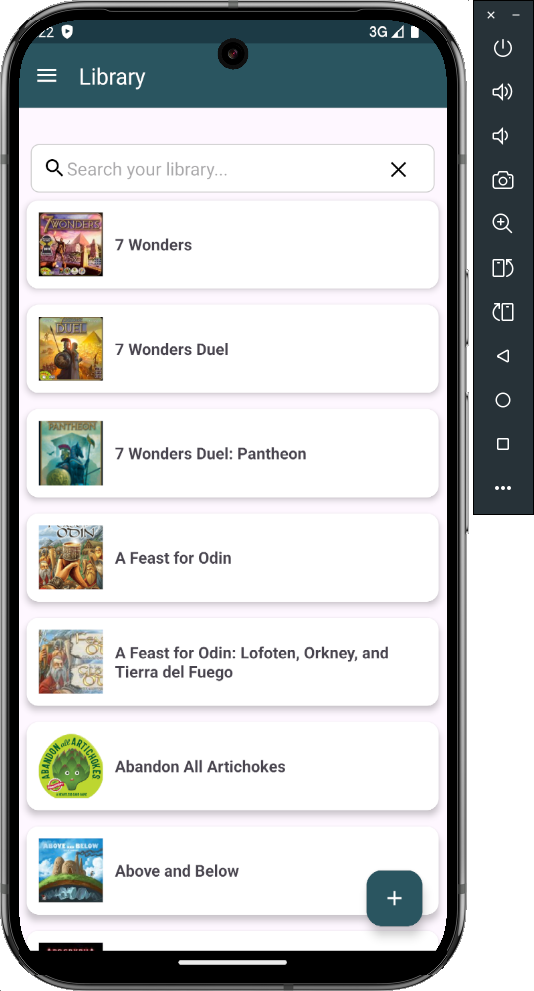

# Board Game Assistant 🎲📱

**Board Game Assistant** is a personal Android app built to help you track your board game collection, log plays, manage players, and explore your library in smarter ways. Built in Kotlin with Jetpack and Firebase, it supports live sync and multi-user features through friend codes.

## Features

- 📥 Import collection from BoardGameGeek  
- 🧑‍🤝‍🧑 Track players and link accounts via friend codes  
- 🕹️ Log and view past plays with scores and winners  
- 🎲 Get random game suggestions based on filters  
- 📈 View detailed game info, including ratings and player counts  
- ☁️ Backed by Firebase Authentication and Cloud Firestore  
- 💎 Modern UI built with Material Design  

## Screenshots

### 🔍 Add Game Search  

### 📚 Library View  

### 📖 Library - Expanded Game  

### 📂 Drawer Menu  

## Setup

1. Clone the repo:

   `git clone https://github.com/your-username/board-game-assistant.git`

2. Add your Firebase `google-services.json` file to the `app/` directory.

3. Build & run via Android Studio (API 33+ recommended).

## Tech Stack

- Kotlin + Jetpack (ViewModel, LiveData, Navigation)
- Firebase Auth + Firestore
- Retrofit + Jsoup for XML parsing from BGG API
- Coroutines + MVVM architecture
- Mockito + JUnit + Espresso for testing

## License

This project is licensed under the [MIT License](LICENSE).

